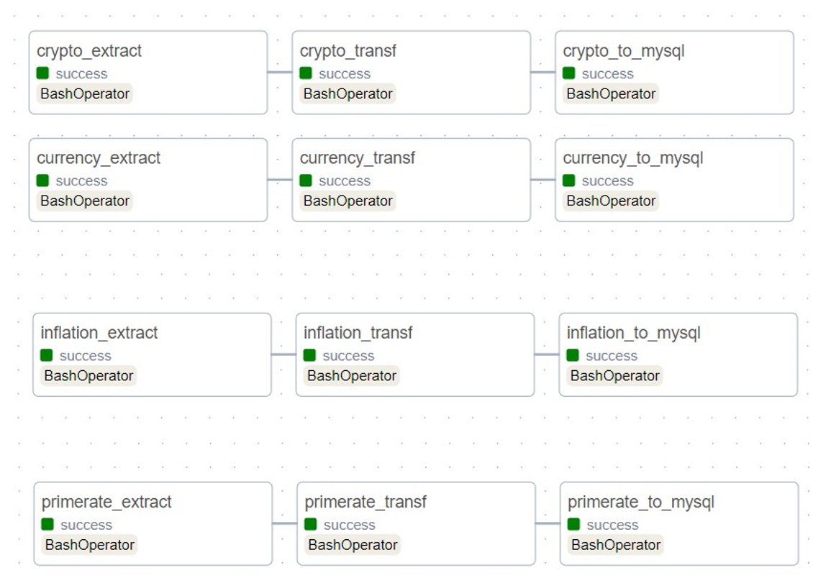
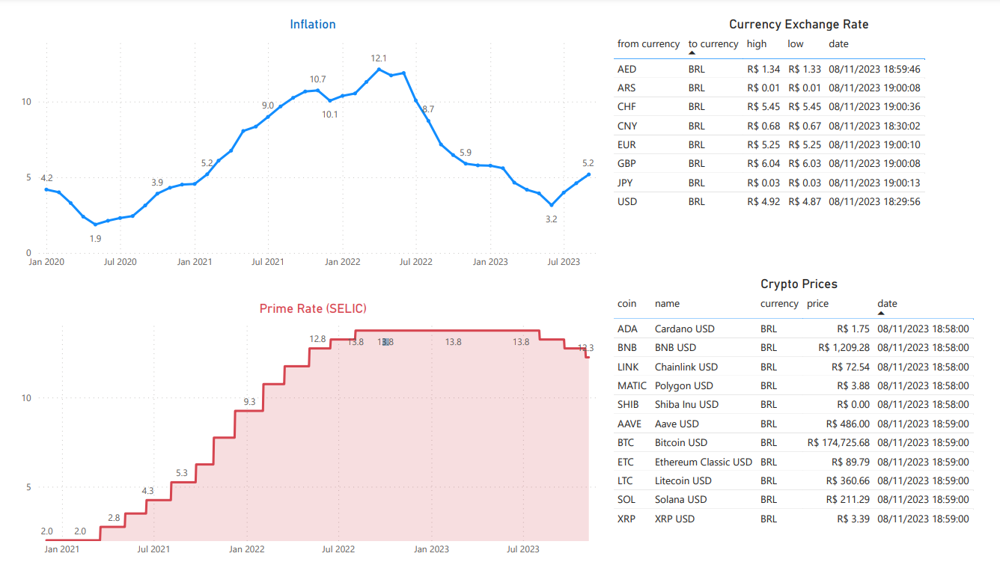

# etl-airflow-pyspark

ETL pipeline with data from a finance API - https://brapi.dev/ 

* Get data (currency, crypto, inflation and primerate) from api and save as json
* Get json and transform with pyspark and save as csv
* Write data in mysql
* Data visualization with powerbi

